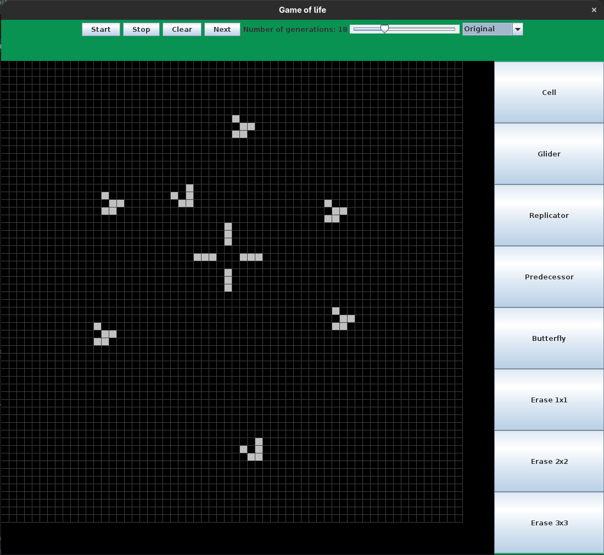

# Game of Life

This small project is a Java-based implementation of Conway's Game of Life and some of its variation.
The goal was to create an application that uses four different design patterns: Mediator, Proxy, State, and Strategy.

## Design Patterns

- **Strategy Pattern:**
  Used to change the underlying algorithm that calculates the next state of the game.

- **State Pattern:**
  Allows switching between different patterns that can be placed on the grid.

- **Proxy Pattern:**
  Prevents placing any pattern on the grid while the game is currently running.

- **Mediator Pattern:**
  Centralizes communication between the different UI components and system panels to keep them loosely coupled.

## Screenshot
